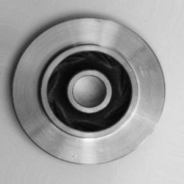
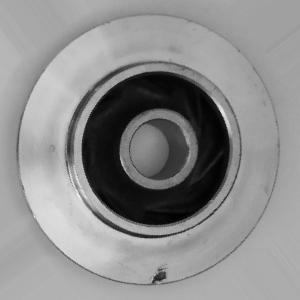

# 2 Data

```{r, echo = FALSE, message = FALSE}
source(here::here("scripts/setup.R"))
```
<br>


Component without any default

<br>


Component with default


<br>

<style>
div.blue { background-color:#e6f0ff; border-radius: 5px; padding: 20px;}
</style>
<div class = "blue">


<br>

## Previous approaches 

This dataset has previously been analysed with deep learning techniques including convolutional neural networks (CNN) with maximum pooling layers[[2]](https://www.kaggle.com/koheimuramatsu/model-explainability-in-industrial-image-detection)[[3]](https://www.kaggle.com/sayooj98/fault-diagnosis-using-cnn), as well transfer learning approaches with pre-trained models including Resnet34[[4]](https://www.kaggle.com/kevinhqh/99-7-accuracy-using-resnet34-casting-defect) and VGG16[[5]](https://www.kaggle.com/dhruvmak/fine-tuning-vgg16).

Some have even tried  to use other machine learning techniques such as support vector machines and the K-nearest neighbor classifier[[6]](https://www.kaggle.com/mcahitgamsz/product-image-for-quality-inspection-scv-acc-99). The latter produced somewhat weaker accuracy results than the neural networks, yet still reasonably high at 98%, so our deep learning models should aim for this as a minimum.


We obtained our dataset from the Kaggle website. [[7]](https://www.kaggle.com/ravirajsinh45/real-life-industrial-dataset-of-casting-product)

It contains 7348 images of defective or correctly casted submersible pump impellers. The images all grey-scaled, with 300*300 pixels, as you can see in the two examples above. They have been split into training and test sets as in the table below. There are somewhat more faulty images than correct ones, but overall the dataset is reasonably balanced, with a significant number of samples for both cases.


TRAINING SET      |
|-----------------|------------|
| DEFAULT [1]     | OK [0]     |
| 3758 IMAGES     | 2875 IMAGES|


TEST SET          |  
|-----------------|------------|
| DEFAULT [1]     | OK [0]     |
| 453 IMAGES      | 262 IMAGES |

</div>